# 🚀 LeadFlow CRM - Enterprise Client Intelligence System

LeadFlow CRM is a high-performance, full-stack Client Lead Management System designed for enterprise-scale sales operations. It provides a data-driven, premium workspace utilizing predictive lead scoring, secure role-based access, and real-time activity tracking to maximize conversion rates.

---

## 📸 Application Showcases

<div align="center">
  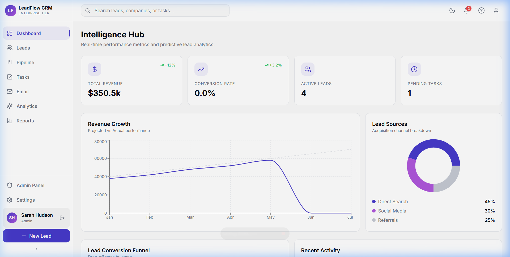
  <p><em>Modern Analytics Dashboard with Real-time Intelligence Hub</em></p>
  
  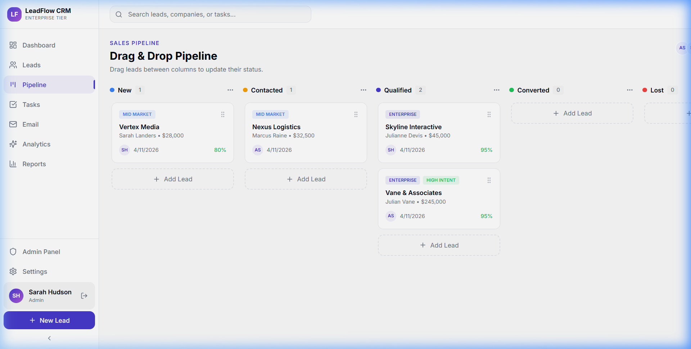
  <p><em>Dynamic Drag & Drop Sales Pipeline for Visual Lead Tracking</em></p>

  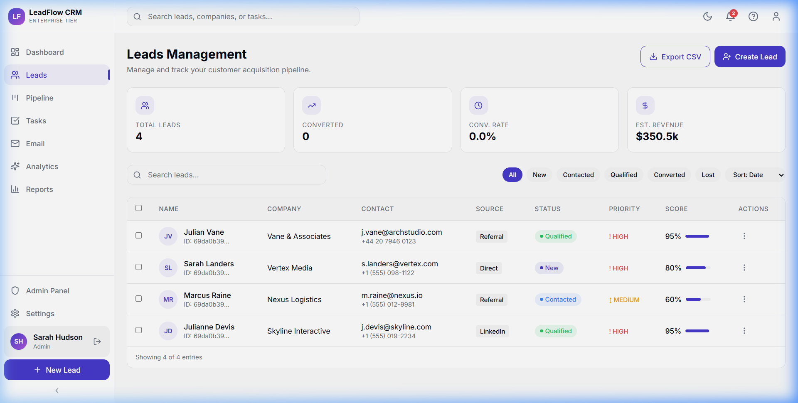
  <p><em>Premium Leads Management with Integrated AI Scoring</em></p>

  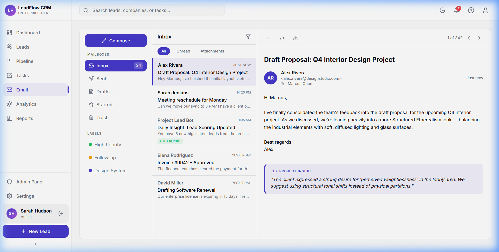
  <p><em>Centralized Communication Hub with Automated Inbox Categorization</em></p>
</div>

---

## 🏗️ Architectural Design (Deep Dive)

LeadFlow CRM utilizes a decoupled **Layered Architecture** to ensure scalability, maintainability, and security.

### 1. High-Level System Architecture
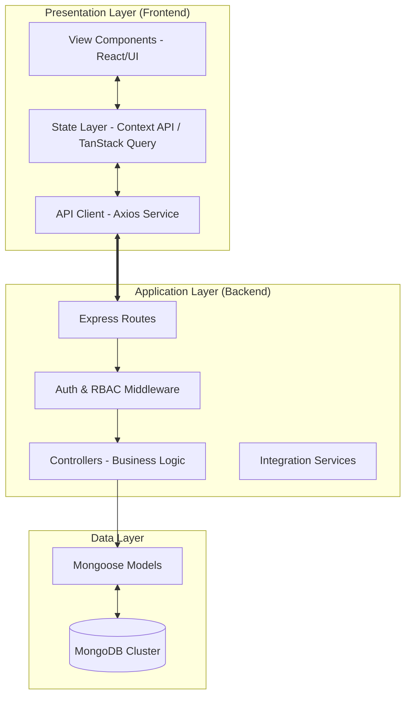

### 2. Architectural Components
-   **Frontend**: A single-page application (SPA) built with React and Vite. It utilizes a **Context-Provider pattern** for global auth and CRM state, ensuring consistent data availability across the component tree.
-   **Backend**: A RESTful API built on Node.js and Express. It implements a **Controller-Service pattern** to separate HTTP concerns from core business logic.
-   **Security**: Implements stateless **JWT Authentication** with an extra layer of **Role-Based Access Control (RBAC)** filters at the route level.

---

## 👥 Comprehensive Use Case Analysis

### 1. Sales Operations Use Case
Focuses on the daily activities of Sales Representatives to move leads through the funnel.

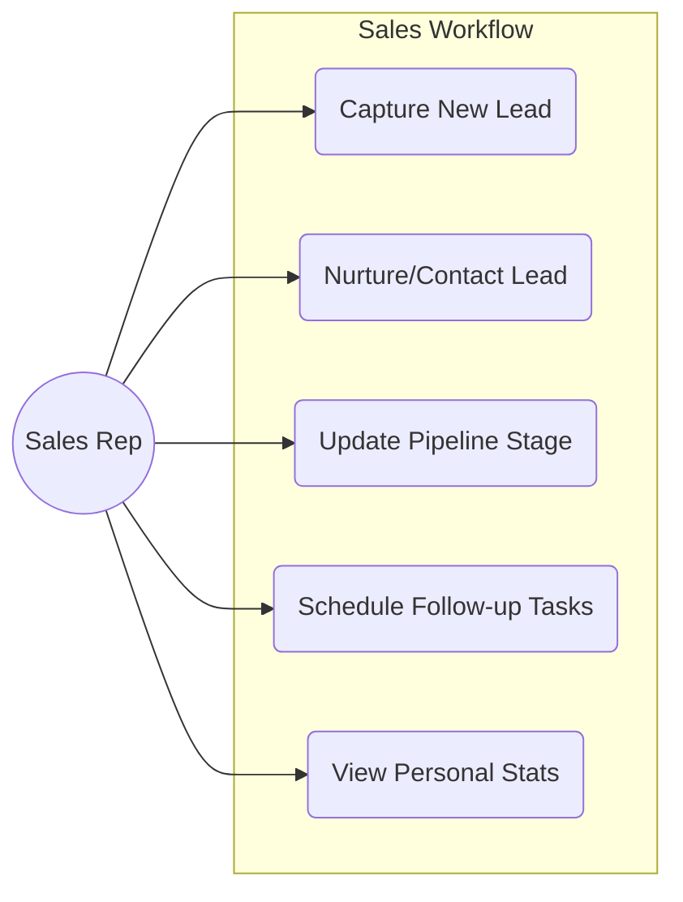

### 2. Administrative & Managerial Control Use Case
Focuses on oversight, system health, and team performance metrics.

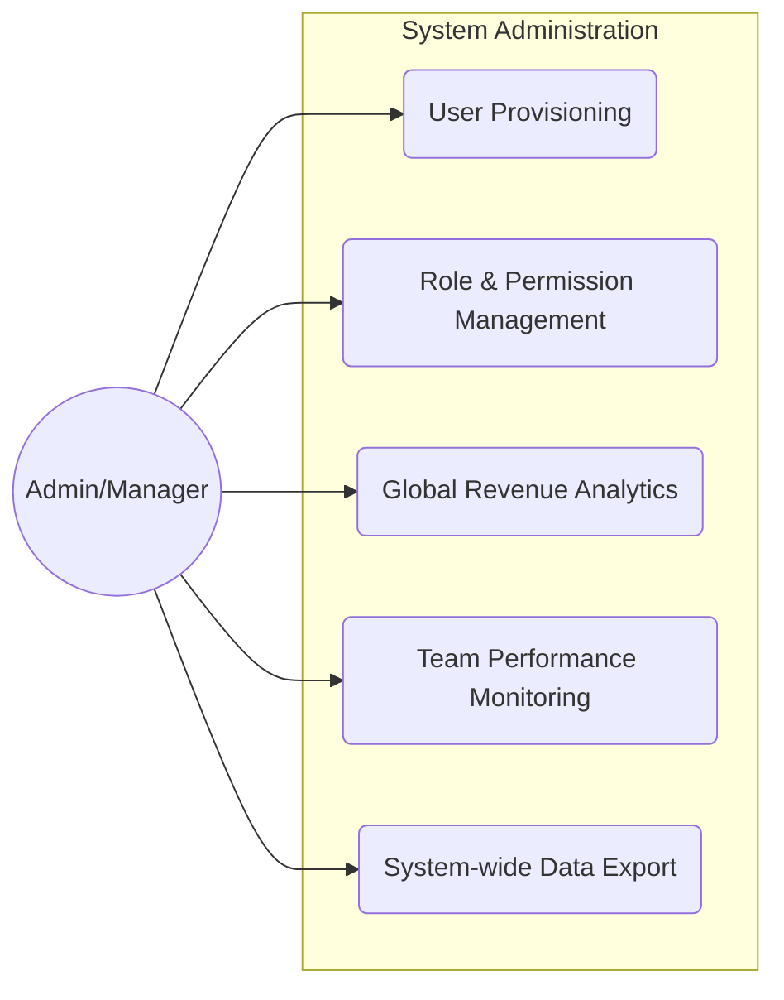

### 3. Interaction & Activity Management Use Case
Covers the automated tracking system that logs every touchpoint with a lead.

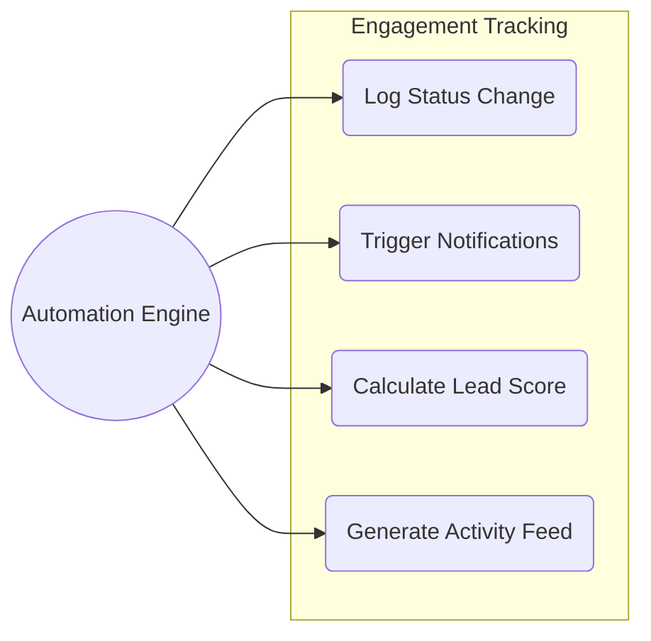

---

## 🔄 Exhaustive Sequential Flows

### 1. Secure Authentication Sequence (Login)
How a user establishes a secure session.

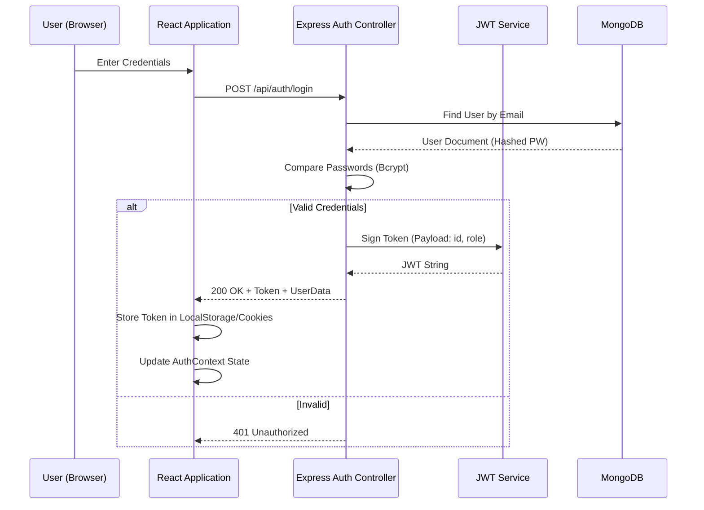

### 2. Lead Lifecycle & Pipeline Transition
The flow of updating a lead status via Drag-and-Drop.

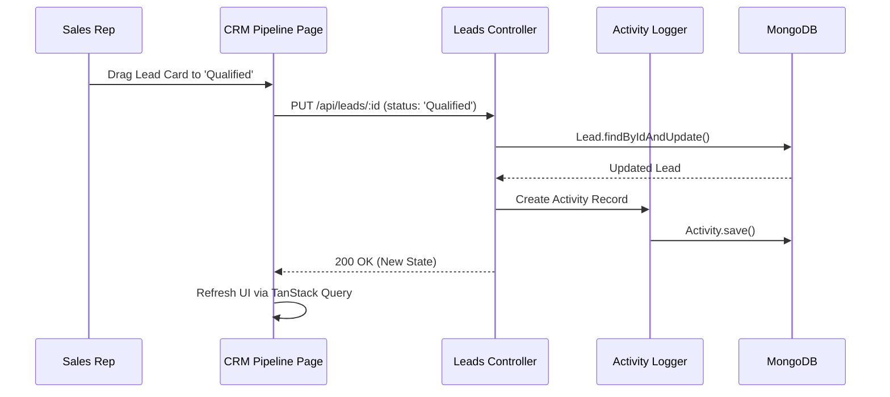

### 3. Automated Task & Notification Flow
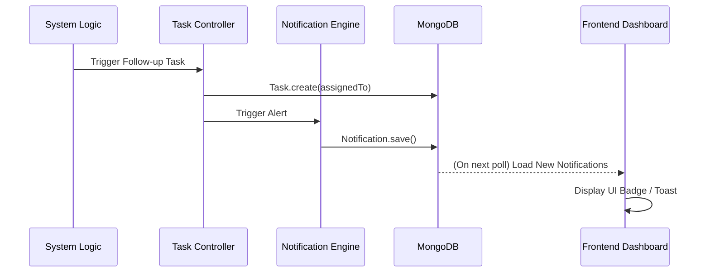

---

## 📊 Data Modeling & Entity Relationships (ERD)

The database schema is optimized for relational consistency within a document-based store.

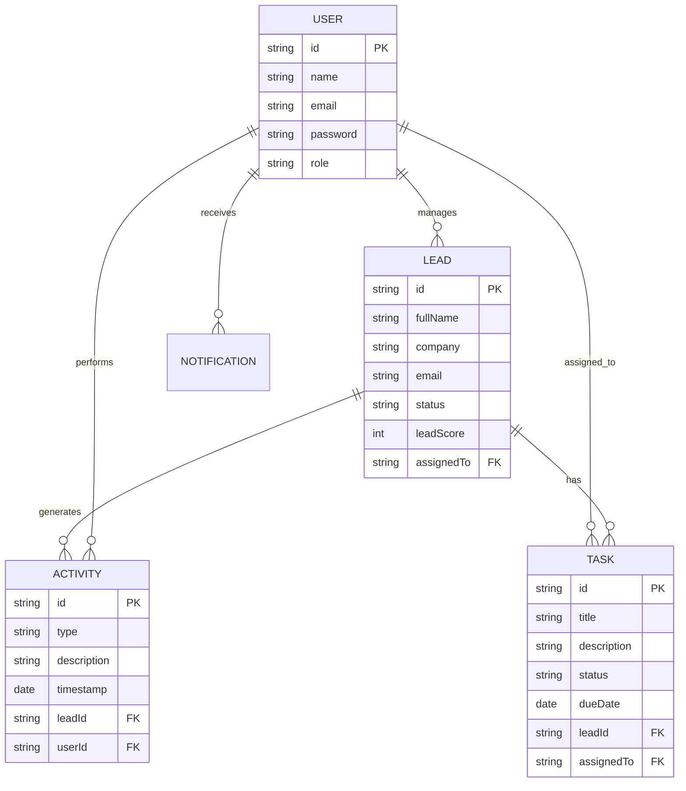

---

## 🌐 Deployment Topology

LeadFlow CRM is designed for cloud-native deployment.

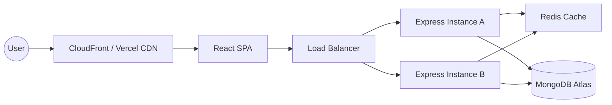

---

## 🎨 Design System & UI/UX Principles

-   **Aesthetic**: "Premium Tech" using vibrant indigo/rose gradients, slate surfaces, and glassmorphic overlays.
-   **Typography**: `Inter` for functional data, `Outfit` for display headings.
-   **Micro-interactions**: Subtle hover states, smooth Kanban transitions, and animated dashboard charts.
-   **Accessibility**: High-contrast ratios for data points and screen-reader-friendly semantic HTML.

---

## 🛠️ Technical Deep-Dives

### 🔐 Security & RBAC
LeadFlow uses a middleware-first approach to security. The `protect` and `authorize` middlewares verify the JWT and enforce role constraints before reaching the controller.
- **Admin**: Access to all leads, stats, and user management.
- **Manager**: Access to team stats and global leads.
- **Sales Rep**: Isolated access to only their assigned leads and tasks.

### 💾 Data Synchronization & Mongoose Middleware
To bridge the gap between MongoDB's `_id` and the Frontend's expectation of `id`, we use Mongoose `toJSON` transforms:
```javascript
schema.set('toJSON', {
  virtuals: true,
  transform: (doc, ret) => {
    ret.id = ret._id;
    delete ret._id;
    delete ret.__v;
  }
});
```
This ensures a seamless development experience in React without manual ID mapping.

---

## ⚙️ Project Setup

### 1. Backend
```bash
cd backend
npm install
# Configure .env with MONGODB_URI & JWT_SECRET
npm run dev
```

### 2. Frontend
```bash
cd frontend
npm install
npm run dev
```

---

## 📁 Repository Map
```text
├── backend/            # REST API (Node/Express)
│   ├── controllers/    # Request handling logic
│   ├── middleware/     # Auth, Errors, RBAC
│   ├── models/         # Mongoose Data Schemas
│   └── routes/         # API Endpoint mapping
├── frontend/           # SPA (React/Vite)
│   ├── src/context/    # State management (Auth/CRM)
│   ├── src/pages/      # Feature views
│   └── src/services/   # API abstraction layer
└── docs/               # Screenshots and assets
```
